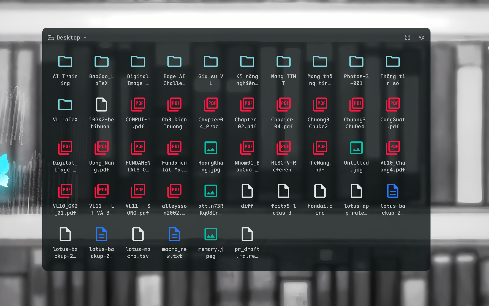

# Folder View

A folder viewer widget that displays and manages files and directories on your screen.



## Install

Use the DMS CLI:
```bash
dms plugins install folderView
```

Or manually:
```bash
git clone https://github.com/hthienloc/dms-folder-view ~/.config/DankMaterialShell/plugins/folderView
```

## Features

- **Directory Switching:** Switch between predefined system folders (Desktop, Downloads, Home, etc.) or any custom directory path.
- **Multiple Layouts:** Toggle between Grid View, List View, and Compact View (configured in settings; Compact View automatically wraps into columns based on widget width).
- **Quick Controls:** Search/filter items, sort files (by Name, Date, Size, Type), or trigger item creation directly from widget header controls.
- **Adjustable Sizing:** Customize item icon sizes (Small, Medium, Large, Extra Large) via the plugin settings panel.
- **File Operations:** Core file management actions including item creation (Folder/Document), renaming, copying paths, trashing, and system clipboard file copy.
- **Multi-selection:** Multi-select items using `Ctrl` and `Shift` modifiers for bulk operations.
- **Visual Previews:** Live image thumbnails and album art extraction for audio files.

## Usage

| Input Action | Result |
|---|---|
| **Left Click Folder Title** | Open directory selection dropdown (Desktop, Downloads, Trash, Home, Custom, etc.) |
| **Left Click `+` Icon** | Open creation dropdown (New Folder, New Document) |
| **Left Click Sort Icon** | Open sorting options dropdown (Name, Date, Size, Type) |
| **Left Click Search Icon** | Expand/collapse search input to filter files instantly by name |
| **Left Click File/Folder** | Select individual item |
| **Ctrl + Left Click** | Toggle selection on multiple items |
| **Shift + Left Click** | Select range of items |
| **Double Click Item** | Open folder or run file with system default application |
| **Middle Click Item** | Open context menu (Open, Float File, Copy, Copy Path, Rename, Trash) |
| **Left Click Empty Space** | Clear current selection |
| **Middle Click Empty Space** | Paste files, folders, or clipboard screenshots into active folder |

*Note: Layout modes (Grid, List, Compact) and item icon sizing can be customized inside the plugin settings panel.*

### Pin-to-Desktop (Float File)

To pin your images or PDF files as borderless, floating desktop widgets (always-on-top picture-in-picture windows), you can use the companion [dms-floaty](https://github.com/hthienloc/dms-floaty) plugin. Folder View integrates seamlessly with `dms-floaty` out-of-the-box, allowing you to float any image or PDF file directly from the middle-click context menu.

## Requirements

- `python3` - Required only for handling advanced clipboard paste operations (e.g., pasting images/screenshots from clipboard).
- `wl-clipboard` - Required for `wl-copy` (copying non-image files to clipboard) and `wl-paste` (reading clipboard during Paste).
- `glib2` (or `gio`) - Required for trashing files cleanly (`gio trash`).

## License

GPL-3.0

## TODO / Roadmap

- [x] **Drag & Drop (Out):** Drag files directly from the widget into external windows.
- [ ] **Drag & Drop (In):** Support dropping files from external windows into the widget.
- [ ] **Inline Rename:** Quick renaming by clicking the label of a selected item.
- [x] **Multi-file operations:** Select multiple items using Ctrl/Shift and perform bulk copies, moves, or trashing.
- [x] **File Search:** Add a small integrated search field in the header to filter large directories instantly.
- [x] **Folder & File Creation:** Add a quick action button to create new folders or empty text documents directly within the widget.
- [x] **Enhanced Info UI:** Improved file/folder details dialog with structured data and copyable path.
- [x] **Folder Status:** Display item counts and selection status in the header.
- [x] **Image & Audio Thumbnails:** Show image previews and album art for music files.
- [x] **PDF Thumbnails:** Show first page preview for PDF documents.
- [ ] **Terminal Integration:** "Open in Terminal" or "Open in VS Code" shortcuts for the active directory.
- [ ] **Archive Support:** Basic management (view/extract) for compressed files (.zip, .tar.gz).
